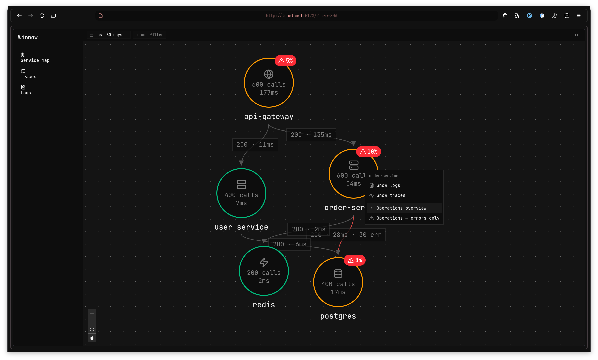
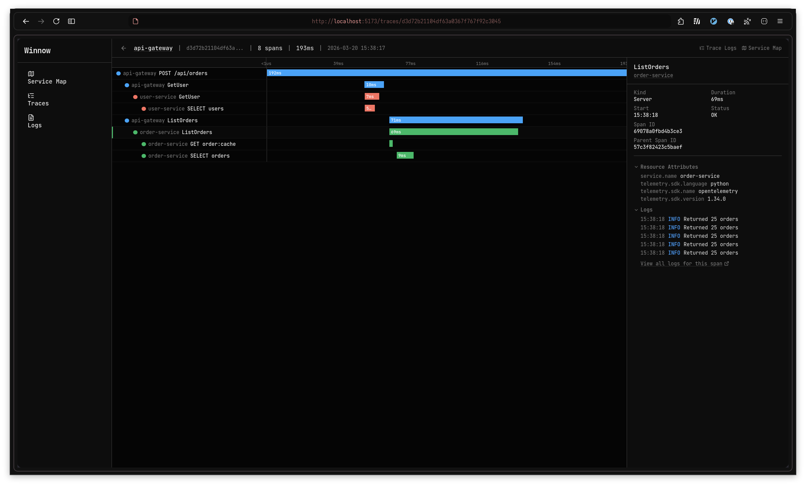
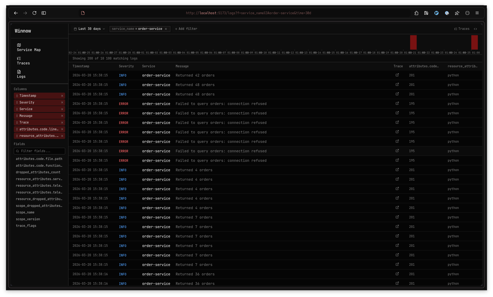

# Winnow

An opinionated observability UI built on [Quickwit](https://quickwit.io). Accepts OpenTelemetry traces and logs, stores everything in Quickwit, and provides a single unified interface for navigating your system.

Born from frustration with Grafana's approach to observability. Instead of a general-purpose dashboarding tool that supports every backend and visualization, Winnow does fewer things and does them well. One storage backend, one interface, no configuration pages.

## Screenshots

<p align="center">
  
</p>

The service map is the primary entry point. It shows your service topology with call counts, latencies, and error rates at a glance. Click any node to drill into its traces, logs, or operations.

<p align="center">
  
</p>

The trace detail view shows a waterfall timeline of all spans in a trace. Select a span to see its attributes, resource metadata, and associated logs in the right panel.

<p align="center">
  
</p>

The log viewer supports configurable columns, filters, sortable headers, and a time histogram. Every log with a trace ID links directly to its trace.

## What it does

Winnow receives OTLP data (traces and logs) over HTTP, transforms it, and ingests it into Quickwit. The frontend provides three connected views: a service map derived from trace data, a trace explorer with span waterfall timelines, and a log viewer. Everything is linked. Click a service to see its traces, click a trace to see its logs, click a log to jump to the span that produced it.

The entire application ships as a single binary. The frontend is embedded at build time. Point it at a Quickwit instance and go.

## Stack

The backend is written in Zig. The frontend is React with TypeScript and shadcn/ui. Quickwit is the only external dependency at runtime. Nix handles all build tooling and packaging.

## Running

### With Nix (recommended)

Build and run directly from the repository:

```
nix build
./result/bin/winnow
```

By default the API and UI listen on port 8080 and the collector on port 4318. Quickwit is expected at `http://localhost:7280`. Configure via environment variables:

```
QUICKWIT_URL=http://quickwit.example.com:7280 ./result/bin/winnow
```

You can also run without cloning, directly from a flake reference:

```
nix run github:ourstudio-se/winnow
```

### Sending data

Point any OpenTelemetry SDK at the server's OTLP HTTP endpoint:

```
export OTEL_EXPORTER_OTLP_ENDPOINT=http://localhost:8080
```

The server accepts `POST /v1/traces`, `POST /v1/logs`, and `POST /v1/metrics` in OTLP protobuf format. The metrics endpoint is used by the OTel Collector's servicegraph connector to feed pre-aggregated service edge data.

### Configuration

Configuration is resolved in order: defaults < KDL config file < environment variables.

**Config file** (optional):

```kdl
quickwit url="http://localhost:7280"
traces index="winnow-traces-v0_1" retention="90 days"
logs index="winnow-logs-v0_1" retention="30 days"
edges index="winnow-edges-v0_3" retention="7 days"
```

Pass with `--config`:

```
./result/bin/winnow --config /path/to/winnow.kdl
```

If no `--config` is given, the server looks for `./winnow.kdl` in the working directory. If no file is found, bare defaults are used.

**Serve blocks** (optional):

Each `serve` block defines one HTTP listener and the roles it runs. There are three roles:

- `api` — the query API the frontend talks to (`/api/v1/...`)
- `ui` — serves the embedded frontend assets and the UI bootstrap config
- `collector` — the OTLP ingest endpoints (`/v1/traces`, `/v1/logs`, `/v1/metrics`)

By default (no `serve` block), api + ui run on port 8080 and the collector on port 4318:

```kdl
// Equivalent to the defaults
serve http_port=8080 {
    api
    ui
}
serve http_port=4318 {
    collector
}
```

A `serve` block accepts `http_port` and `number_of_workers` (HTTP worker threads, default: 6) as properties. Roles a listener doesn't declare return 404 on that port. A `serve` block with no roles is an error, and two `serve` blocks on the same port are an error.

Roles can be split across ports — or across separate processes, each running with a config that declares only its own roles — to scale ingest (collector) and user-facing queries (api/ui) independently.

**UI role parameters:**

The `ui` role takes optional child nodes:

```kdl
serve http_port=3020 {
    ui {
        login_url "https://idp.example.com/login?return_to={winnow_return_url}"
        logout_url "https://idp.example.com/logout"
        api_url "http://api-node.internal:8080"
    }
}
```

- `login_url` / `logout_url` — exposed to the frontend via the unauthenticated `GET /api/v1/ui-config` endpoint. When an API request is rejected with 401, the frontend redirects to `login_url`; a logout button appears when `logout_url` is set. Both may contain a `{winnow_return_url}` placeholder, which the frontend substitutes with the current page URL so the login flow can return the user to where they were.
- `api_url` — when set, the ui node reverse-proxies all `/api/*` requests (except `ui-config` itself) to this base URL. This is how a split deployment works: the browser only ever talks to the ui node's origin (no CORS involved), and the ui node forwards API traffic to the api node.

**Auth blocks:**

Authorization is opt-in per role. Define a named `auth` block and attach it to a role with the `auth` property:

```kdl
serve http_port=8080 {
    api auth="my-auth"
}

auth name="my-auth" {
    strategy "cookie"      // "cookie" or "bearer"
    cookie_name "jwt"      // required for the cookie strategy

    config kind="module" {
        module "my-module"
    }
}
```

The `strategy` decides where the credential comes from: `bearer` reads the `Authorization: Bearer ...` header, `cookie` reads the named cookie. The credential is then passed to an auth module (the only supported `config kind` today), whose verdict maps to the response: `unauthenticated` → 401 (the frontend redirects to `login_url`), `unauthorized` → 403 (the frontend shows a forbidden page), errors → 500.

Note: the `ui` role's `GET /api/v1/ui-config` endpoint is how a logged-out frontend learns the login URL — don't put an `auth` gate on the ui node, or the login flow can never bootstrap. Gate the api role instead.

**Module blocks:**

Modules are shared libraries loaded at startup, referenced by name from auth blocks:

```kdl
module name="my-module" {
    dll "/path/to/libmy-module.so"
    config {
        jwks_issuer_url "https://idp.example.com"
    }
}
```

- `dll` — path to the shared library.
- `config` — arbitrary string key/value pairs passed to the module on init.

A module exports C ABI hooks, all optional: `on_module_init` (receives the config pairs), `on_module_deinit`, and `on_auth` (receives the credential extracted by the strategy and decides accept/reject). A sample module implementing JWT verification against a JWKS endpoint lives in `backend/sample_module/`.

**Environment variables** (override config file values):

```
QUICKWIT_URL            Quickwit base URL (default: http://localhost:7280)
WINNOW_TRACES_INDEX     Quickwit index for traces (default: winnow-traces-v0_1)
WINNOW_LOGS_INDEX       Quickwit index for logs (default: winnow-logs-v0_1)
WINNOW_EDGES_INDEX      Quickwit index for service edges (default: winnow-edges-v0_3)
```

**Startup behavior:**

Index management runs when the config declares an `api` or `collector` role (including via the defaults). A ui-only node never touches Quickwit.

- If an index doesn't exist, the server creates it (with retention policy if configured).
- If an index already exists, the server validates its schema against the expected field mappings. On a mismatch (wrong field type, missing field, wrong tokenizer) the server exits with an error. Retention mismatches produce a warning but don't prevent startup.

## Development

### Prerequisites

Everything is managed by Nix. Enter the dev shell:

```
nix develop
```

This provides Zig, Node.js, pnpm, protoc, and all other tools needed for development.

### Building locally

Inside the dev shell:

```
cd backend
zig build gen-proto   # generate Zig code from .proto files
zig build             # compile the server
zig build run         # compile and run
zig build test        # run tests
```

The frontend uses Vite with a dev proxy. In a separate terminal:

```
cd frontend
pnpm install
pnpm dev
```

This starts Vite on port 5173 and proxies `/api` and `/v1` requests to the backend on port 8080. During development you work against the Vite dev server and iterate on frontend and backend independently.

### Testing the single binary locally

To test the production build locally without going through `nix build`:

```
cd frontend && pnpm build && cd ..
cd backend
ln -sfn ../../frontend/dist src/frontend-dist
bash ../scripts/embed-frontend.sh src/frontend-dist src/static_assets.zig
zig build run
```

Then visit `http://localhost:8080`.

### Nix flake outputs

```
packages.default      Single binary with embedded frontend
packages.frontend     Frontend dist built via pnpm
devShells.default     Development environment with all tools
checks.integration    NixOS VM integration test (Linux only)
```

### Quickwit for development

A `docker-compose.yml` is provided for running Quickwit locally. The dev shell sets `QUICKWIT_URL=http://localhost:7290` (port 7290 to avoid collisions). A data generator is available as `generate-data` inside the dev shell.

## Project structure

```
backend/              Zig source code and build files
backend/proto/        Vendored OTLP .proto definitions
backend/src/          Server source (main.zig, api.zig, ingest.zig, etc.)
frontend/             React/TypeScript frontend
scripts/              Build and dev tooling scripts
tests/                NixOS VM integration tests
docs/                 Architecture docs, roadmap, and TODO
```

## License

TBD
